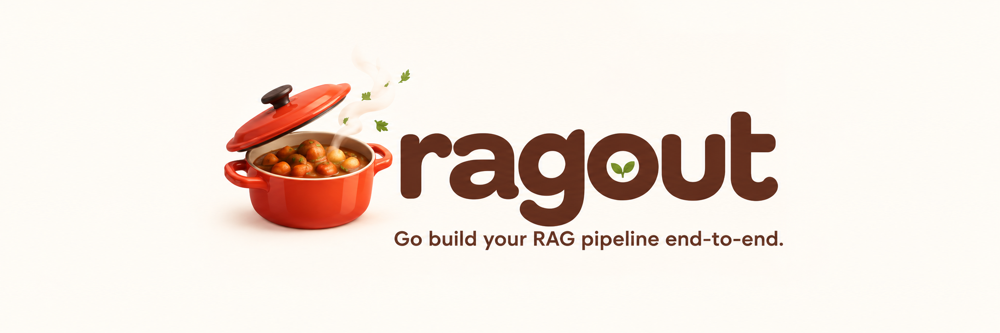
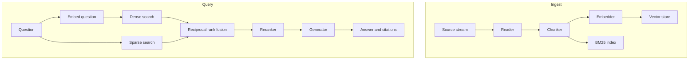

# Ragout

[](LICENSE)
[](https://pkg.go.dev/github.com/chengyaolee/ragout)
[](https://github.com/chengyaolee/ragout/actions/workflows/test.yml)

<p align="center">
  
</p>

## Why Ragout

A Go service that "does RAG" usually embeds a file, asks one vector database for neighbors, and pastes those chunks into a prompt. Paraphrases survive that. Exact terms often do not: an error code, a SKU, a function name. The prompt then grows until the model loses the passage in the middle, and the answer comes back with nothing to point at.

Ragout is that pipeline, already assembled, for code that has to stay in Go.

- **Keyword and vector search run together.** BM25 and a vector index fan out on every question. Reciprocal rank fusion merges the two rankings, so a paraphrase and an exact token can both surface. Leave either store out and the query still runs.
- **The answer names its sources.** Chunks compete for a token budget. The ones that fit are numbered `[1]`, `[2]`, and the strongest sit at both ends of the prompt, where models actually read them. `Answer.Sources[i]` is citation `[i+1]`.
- **Nothing else has to be running.** The vector index and the BM25 index live in the process. Snapshot them to a file, or point the same interface at Chroma or Qdrant when the data outgrows memory.
- **Each stage is one interface.** Swap the reader, the chunker, the embedder, the store, the reranker, or the generator without touching the engine. OpenAI and Ollama clients ship in the module. A type you write yourself is the same shape.

| Project | What it is |
| --- | --- |
| **Ragout** | The pipeline: ingest, hybrid search, optional rerank, cited generation, streaming. |
| [LangChainGo](https://github.com/tmc/langchaingo), [LinGoose](https://github.com/henomis/lingoose), [GoLC](https://github.com/hupe1980/golc) | LLM toolkits. You assemble retrieval from providers and vector-store adapters. |
| [chromem-go](https://github.com/philippgille/chromem-go) | An embeddable vector index. |
| Weaviate, Qdrant, Chroma | Databases. Ragout talks to Qdrant and Chroma over HTTP, and also ships an in-memory vector index plus BM25 so a service can run with no extra process. |

## Try it

No key, no database, no model server. From a clone of this repo:

```bash
go test ./...
go run ./examples/demo
```

`go test` is the full suite. [`examples/demo`](examples/demo/main.go) indexes three short notes in memory, runs hybrid search, and prints the cited chunk. The embedder is a local stand-in. Swap it for `embedder.NewOpenAIEmbedder` or `embedder.NewOllamaEmbedder` when you want real vectors.

## Overview

```bash
go get github.com/chengyaolee/ragout
```

You wire a reader, a chunker, an embedder, at least one store, and a generator. `Ingest` indexes a document. `Query` searches, fuses, and returns an answer plus the chunks it cited.

```go
chunks, err := chunker.NewCharacterChunker(800, 100, nil)
engine, err := ragout.NewEngine(
    ragout.WithReader(reader.NewByExtension(10<<20)),
    ragout.WithChunker(chunks),
    ragout.WithEmbedder(embedder.NewOpenAIEmbedder(os.Getenv("OPENAI_API_KEY"))),
    ragout.WithVectorStore(store.NewVectorStore()),
    ragout.WithIndexStore(store.NewBM25Index()),
    ragout.WithGenerator(generator.NewOpenAIGenerator(os.Getenv("OPENAI_API_KEY"))),
)

f, err := os.Open("notes.md")
defer f.Close()
err = engine.Ingest(ctx, "notes.md", f, nil)

answer, err := engine.Query(ctx, "What is this document about?")
fmt.Println(answer.Text)
for i, src := range answer.Sources {
    source, _ := src.Chunk.Metadata[ragout.MetadataSource].(string)
    fmt.Printf("[%d] %s\n", i+1, source)
}
```

The runnable copy is [`examples/quickstart`](examples/quickstart/main.go). It reads `OPENAI_API_KEY` and a file path. Ollama setup is [local models](docs/getting-started/local.md).

Readers cover `.txt`, `.md`, `.html`, `.pdf`, and `.docx`, with a byte cap. Chunk IDs stay stable across retries. If one store write fails, both stores drop that document. `Query`, `QueryStream`, and `QueryIter` share one retrieval path, and sources are filled before the first token. OpenTelemetry spans and Prometheus histograms record each stage.

## Architecture



Ingest chunks the document, embeds the chunks on a bounded worker pool, and writes the vector store and the BM25 index at the same time. Query embeds the question, fans out to both indexes, fuses the rankings, optionally reranks, and generates. With one store, fusion is skipped and that store's ranking is used. With no reranker, the engine keeps the first `topN` chunks.

## Components

| Piece | Package | Role |
| --- | --- | --- |
| Engine | [`ragout`](docs/components/engine.md) | `Ingest`, `Query`, `QueryStream`, `QueryIter` |
| Readers | [`reader`](docs/components/readers.md) | Text, Markdown, HTML, PDF, DOCX, or dispatch by extension |
| Chunkers | [`chunker`](docs/components/chunkers.md) | Recursive character windows, or tiktoken windows |
| Embedders | [`embedder`](docs/components/embedders.md) | OpenAI, Ollama, and a rate limiter |
| Stores | [`store`](docs/components/stores.md) | In-memory vectors, BM25, Chroma, Qdrant |
| Rerankers | [`reranker`](docs/components/rerankers.md) | Cohere, or maximal marginal relevance |
| Generators | [`generator`](docs/components/generators.md) | OpenAI and Ollama, with a context budget |

## Documentation

- [Get started](docs/getting-started/installation.md) — install, [quickstart](docs/getting-started/quickstart.md), [local Ollama](docs/getting-started/local.md)
- [Concepts](docs/concepts/pipeline.md) — how a query runs, documents, hybrid retrieval, generation, streaming
- [How-to guides](docs/how-to/ingest-files.md) — files, metadata filters, stores, reranking, traces
- [Components](docs/components/engine.md) — constructors and options for each package
- [Roadmap](docs/roadmap.md) — contextual retrieval, query transforms, agentic loops, GraphRAG

The full index is [docs/README.md](docs/README.md).

## Roadmap

Shipped today: hybrid dense and BM25 retrieval, RRF, Cohere and MMR rerankers, cited streaming answers, in-memory persistence, Chroma, and Qdrant.

Next, still unshipped: contextual chunk prefixes, multi-query and HyDE transforms, a local HTTP cross-encoder, a self-check query loop, and GraphRAG. Details are on the [roadmap](docs/roadmap.md).

## License

[MIT](LICENSE). Copyright (c) 2026 chengyaolee.
